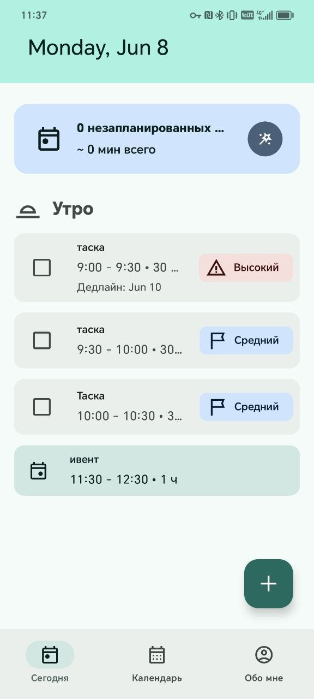
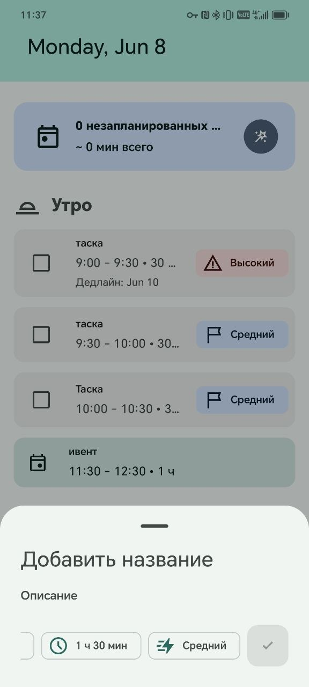
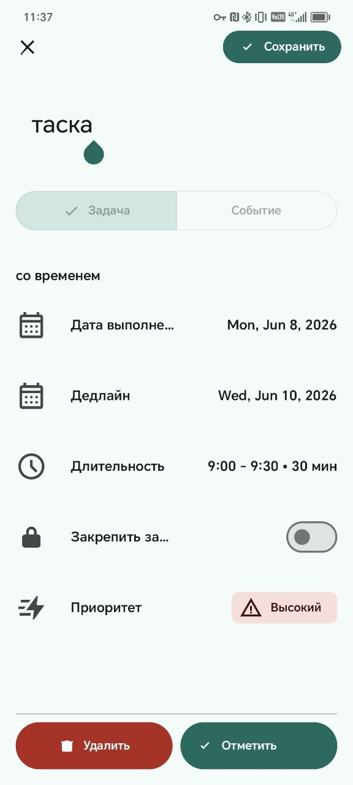
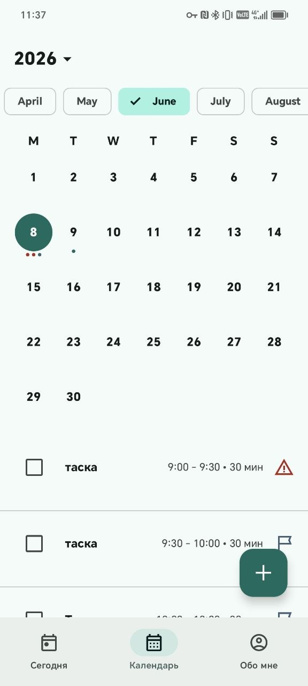

# Smart Scheduler 🗓️

<p align="center">
  
</p>

<p align="center">
  <strong>Offline-first Android planner that turns a task backlog into a realistic day plan</strong><br>
  Built with Kotlin, Jetpack Compose, Material Design 3, Room, and Hilt
</p>

<p align="center">
  
  
  
  
  
</p>

---

## 📱 Screenshots

<table>
  <tr>
    <td align="center">
      <br>
      <strong>Today</strong>
    </td>
    <td align="center">
      <br>
      <strong>Fast Add</strong>
    </td>
  </tr>
  <tr>
    <td align="center">
      <br>
      <strong>Task Detail</strong>
    </td>
    <td align="center">
      <br>
      <strong>Calendar</strong>
    </td>
  </tr>
</table>

---

## ✨ Features

### 🧠 Smart Reschedule
- **Backlog to plan**: automatically places selected unscheduled tasks into free workday windows.
- **Reviewable diff**: shows proposed `Added`, `Moved`, and `Deferred` changes before anything is applied.
- **Explicit apply path**: schedule changes are committed only after the user taps Apply.
- **Reject or restore**: every proposed change can be rejected and restored during review.

### ✅ Task Planning
- **Scheduled and unscheduled tasks**: tasks can live in a backlog or be placed into a concrete time slot.
- **Deadline support**: task cards and edit screens show a dedicated deadline field, separate from schedule date.
- **Priority-aware planning**: tasks are ordered by priority, deadline, duration, and stable ID.
- **Locked and completed tasks**: locked or completed scheduled tasks are preserved by the scheduler.

### 📅 Calendar and Today Views
- **Today timeline**: shows morning and afternoon schedule sections.
- **Calendar overview**: browse monthly planning data and selected-day agenda.
- **Fast add sheets**: quickly create tasks and events, or open the full-screen editor.
- **Events as blockers**: events reserve time windows and are respected by Smart Reschedule.

### ⚙️ Personal Settings
- **Workday boundaries**: configure planning start and end time.
- **Default durations**: choose default task and event durations.
- **Theme settings**: system, light, dark, and dynamic color support.
- **Persistent storage**: tasks and events are stored in Room; settings are stored in DataStore.

---

## 🛠️ Tech Stack

| Category | Technology |
|----------|------------|
| **Language** | [Kotlin 2.3.0](https://kotlinlang.org/) |
| **UI Framework** | [Jetpack Compose](https://developer.android.com/jetpack/compose) |
| **Design System** | [Material Design 3](https://m3.material.io/) |
| **Architecture** | MVVM + MVI/UDF with `StateFlow` |
| **Navigation** | AndroidX Navigation 3 with serializable route keys |
| **Dependency Injection** | [Dagger Hilt](https://dagger.dev/hilt/) |
| **Local Database** | [Room](https://developer.android.com/training/data-storage/room) |
| **Settings Storage** | [DataStore Preferences](https://developer.android.com/topic/libraries/architecture/datastore) |
| **Async** | Kotlin Coroutines & Flow |
| **Serialization** | kotlinx.serialization |
| **Code Generation** | KSP |
| **Build System** | Gradle 9.4.1, Android Gradle Plugin 9.2.1 |

### Server

Smart Scheduler currently has **no backend**. The app is local-first and stores data on the device:

- No REST API.
- No remote database.
- No authentication server.
- No network SDKs.
- No analytics, maps, crash reporting, or push SDKs integrated yet.

---

## 📱 Requirements

- **Android 8.0** (API 26) or higher.
- **JDK 17**.
- Android Studio version compatible with AGP `9.2.1` and Kotlin `2.3.0`.

Project SDK configuration:

| Property | Value |
|----------|-------|
| **minSdk** | 26 |
| **targetSdk** | 36 |
| **compileSdk** | 37 |
| **Java source/target** | 17 |

---

## 🚀 Getting Started

### Prerequisites

- Android Studio.
- Android SDK with API 36/37 platform support.
- JDK 17.

### Build

```sh
./gradlew :app:assembleDebug
```

### Run Unit Tests

```sh
./gradlew :app:testDebugUnitTest
```

### Run Lint

```sh
./gradlew :app:lintDebug
```

### Instrumentation Tests

Requires a connected emulator or Android device:

```sh
./gradlew :app:connectedDebugAndroidTest
```

---

## 🏗️ Architecture

The project is a single Android module: `:app`.

Inside the module, code is organized by Clean Architecture-style layers:

```text
app/src/main/java/com/example/smartscheduler/
├── data/
│   ├── local/          # Room database, entities, DAOs
│   ├── mapper/         # Entity <-> domain mapping
│   └── repository/     # Repository implementations
├── di/                 # Hilt modules
├── domain/
│   ├── algorithm/      # Smart Scheduler algorithm
│   ├── model/          # Task, Event, DiffItem, settings models
│   ├── repository/     # Repository contracts
│   └── usecase/        # Scheduling and apply use cases
├── presentation/
│   ├── calendar/       # Calendar screen and state
│   ├── components/     # Reusable Compose components
│   ├── me/             # Settings screen
│   ├── navigation/     # Navigation 3 route setup
│   ├── scheduleitemdetail/ # Full-screen task/event editor
│   ├── smartreschedule/    # Preview, diff, apply flow
│   └── today/          # Today screen and fast add sheets
└── ui/theme/           # Material 3 theme, colors, typography
```

Architecture flow:

```text
Compose UI -> Screen Action -> ViewModel -> Use Case -> Repository -> Room/DataStore
        ^                                                           |
        |---------------------- StateFlow UI State -----------------|
```

---

## 🗃️ Data Model

### Room Tables

| Table | Purpose |
|-------|---------|
| `task` | Stores scheduled and unscheduled tasks |
| `event` | Stores fixed calendar events |

### Task

Tasks are represented as sealed domain types:

| Type | Description |
|------|-------------|
| `UnscheduledTask` | Backlog task without `startTime` and `endTime` |
| `ScheduledTask` | Task placed into a concrete time slot |

Task fields include:

- `id`
- `name`
- `description`
- `status`
- `priority`
- `duration`
- `deadline`
- `preferredPlaceTime`
- `isLocked`
- `startTime`
- `endTime`

### Event

Events are fixed time blockers:

- `id`
- `name`
- `description`
- `startTime`
- `endTime`

There are no foreign key relationships yet. Tasks and events are related logically by overlapping time windows.

---

## 🧪 Testing

Current tests cover:

- Smart Scheduler algorithm behavior.
- Smart Reschedule selection and apply planning.
- Future placement behavior for deferred tasks.
- Diff calculation.
- Calendar month building.
- Room task mapper regression coverage.

Run all local tests:

```sh
./gradlew :app:testDebugUnitTest
```

---

## 🧭 Roadmap

Planned improvements for production maturity:

- Add Room migrations and migration tests before schema changes.
- Add indices for time-window queries after introducing a schema migration.
- Revalidate Smart Reschedule preview before applying changes.
- Expand test coverage for deadlines, priorities, locked tasks, completed tasks, and rejected changes.
- Add Compose UI tests for preview checkbox selection, diff reject/restore, and apply flow.
- Add notifications for deadlines and planned tasks.
- Add sync or backup support if multi-device usage becomes a requirement.
- Add production screenshots and release artifacts.

---

## 📄 License

No license file is currently included. Add a `LICENSE` file before public distribution.

---

<p align="center">
  Built to make task planning realistic, explainable, and reviewable.
</p>
